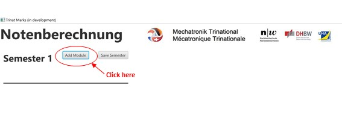
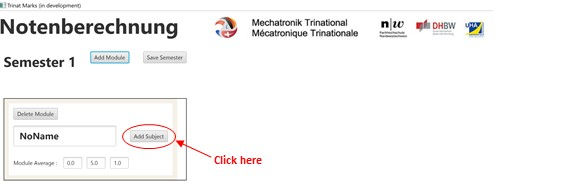
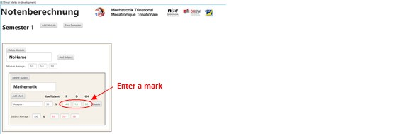
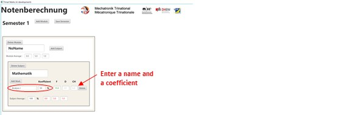
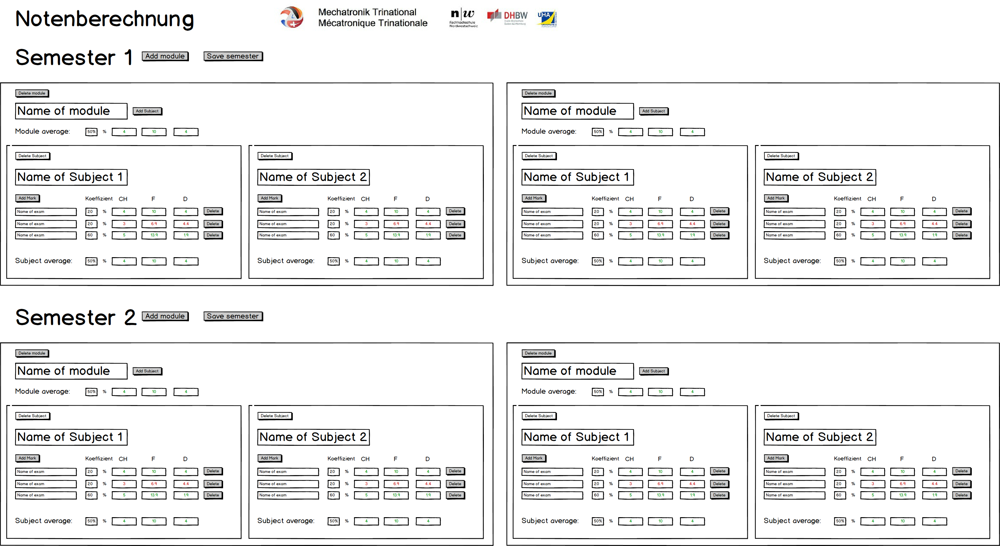

<h1>Trinat-Marks<h1>

 

# Table of contents
1) [Members](<https://github.com/savend/Trinat-Marks#members>)
2) [Introduction](https://github.com/savend/Trinat-Marks#introduction)
3) [Goals](https://github.com/savend/Trinat-Marks#goals)
4) [Boundary conditions](https://github.com/savend/Trinat-Marks#boundary-conditions)
5) [Build Instructions](https://github.com/savend/Trinat-Marks#build-instruction)
6) [Operation manual](https://github.com/savend/Trinat-Marks#operation-manual)
7) [User Stories](https://github.com/savend/Trinat-Marks#user-stories)
8) [Release plan](https://github.com/savend/Trinat-Marks#release-plan)
9) [Documentation Sprint 1](https://github.com/savend/Trinat-Marks#documentation-sprint-1)
10) [Documentation Sprint 2](https://github.com/savend/Trinat-Marks#documentation-sprint-2)
11) [Documentation Sprint 3](https://github.com/savend/Trinat-Marks#documentation-sprint-3)
12) [Test cases due to acceptance criterion](https://github.com/savend/Trinat-Marks#test-cases-due-to-acceptance-criterion)

 

# Members

Adrian Rosser,  Audric Strümpler,  David Buchleither,  Remy Meyer,  Thomas Penner 

 

# Introduction

The project **"Trinat Marks"** and the corresponding Git repository was developed as part of a project work in the course Software Engineering in the study course Mechatronics trinational. The implementation was realized with Java. 

 

# Goals

The aim is to translate the competences learned in the subjects Programing and Software Engineering into an independent student project. Our project is a grade calculator.

The goal is to give the student an overview of his academic achievements.

He has the possibility to create individual modules and to equip them with subordinated subjects. 

The students study in three different countries (Germany, France, Switzerland) and receive grades in three different grading systems. It should therefore be possible to use the grading calculator independently of the grading system.

The passed modules are highlighted in green, the failed modules in red. 

In addition, it is possible to save the scores that have been inserted and completed.

 

# Boundary conditions

The application should be programmed in JAVA and the classes of the program should have the corresponding unit tests.

The project should be published on GitHub.

We want to divide the program into different classes and structure them with methods.

The condition is that this program can be used by MAC, Windows and LinuxComputers.

 

# Build Instruction

1) **Download the file from our repository in Github.**

2) **Extract the downloaded file into the desired folder.**

3) **Copy** *(Strg+c)* **the path of the desired version file** *(.jar)* **to the clipboard.**

4) **Open the console of your computer.**

5) **Enter java -jar followed by the copied path** *(.jar).*

6) **Confirm your entry with Enter.**

 

# Operation manual

**A short functional description of our calculator:**

1) Start application according to build instructions

2) A window will open with six semsters and two buttons. With the button "Add Module" you have the possibility to add a module.

 

3) After the module has been added, you can add a subject. If you want to, you can give the module and subject a name.

 

4) Inside the subject you are now able to add all the marks from that particular subject.

 

5) Afterwards you have the possibility to insert your mark.It doesn't make any difference in which grading system you insert the marks. The program automatically converts the marks in the other two grading systems.

 

6) There is also a textfield where you can set the coefficient for each mark. Make sure that all the coefficients add up to 100%.

 

7) If the mark isn´t sufficient, the mark should be displayed in red, otherwise in green.

8) Next to the "Add Module" button there is another button "Save Semester". Click that button before you close the window, so your newly added elements can be saved. Note: you have to save each semester separately.

 

# User Stories

| **User Story 1** | **Prioritisation** |**Story Point** | **Acceptance criterium** |
|:-:|:-:|:-:|:-:|
|**As a user I want to have the bars turn red if my marks are not good so that I can see easely which Modul I have focus on**|High|2|The program should mark all notes which are worse than the French 10.0 in red, otherwise in green.|

 

| **User Story 2** | **Prioritisation** |**Story Point** | **Acceptance criterium** |
|:-:|:-:|:-:|:-:|
|**As a classleader I want to save a semester configuration to share it with all class members**|Realy low|13|The file can be saved and can be made available to other students.|

 

| **User Story 3** | **Prioritisation** |**Story Point** | **Acceptance criterium** |
|:-:|:-:|:-:|:-:|
|**As a user I want to save my marks so I dont have to reenter my results every time I use the programm**|Low|13|by pressing the "save" button, all inserted marks will be saved.|

 

| **User Story 4** | **Prioritisation** |**Story Point** | **Acceptance criterium** |
|:-:|:-:|:-:|:-:|
|**The Semester schould be configurable as I want for a sustainable programm**|High|5|Each function has its own button which allows you to add more marks and modules.|

 

| **User Story 5** | **Prioritisation** |**Story Point** | **Acceptance criterium** |
|:-:|:-:|:-:|:-:|
|**As a student, I want to delete marks and modules**|Low|8|Each function has its own button which allows you to remove marks and modules.|

 

| **User Story 6** | **Prioritisation** |**Story Point** | **Acceptance criterium** |
|:-:|:-:|:-:|:-:|
|**As a student, I want to add new marks**|High|2|There is a button which allows you to add marks.|

 

| **User Story 7** | **Prioritisation** |**Story Point** | **Acceptance criterium** |
|-|-|-|-|
|**As a student I would like to have my grade average displayed to know if I have passed my modul**|High|3|The program calculates the inserted marks with the respective coefficients and calculates the total average, which is displayed.|

 

| **User Story 8** | **Prioritisation** |**Story Point** | **Acceptance criterium** |
|:-:|:-:|:-:|:-:|
|**As a student I want to define a coefficent for each topic and mark**|High|2|There is a text field in which the respective coefficients can be entered.|

 

| **User Story 9** | **Prioritisation** |**Story Point** | **Acceptance criterium** |
|:-:|:-:|:-:|:-:|
|**As a student, I want to get from 1 input mark the other two marks**|Realy high|8|There are 3 text fields for the mark of each country. If the mark is inserted there it will also be displayed in the other 2 text fields.|

 

| **User Story 10** | **Prioritisation** |**Story Point** | **Acceptance criterium** |
|:-:|:-:|:-:|:-:|
|**As a User I want to enter with a interface a mark in all nationalities to be flexible**|High|2|There are 3 text fields for the respective country mark, so the user has the possibility to fill these as desired.|

 

# Release plan

|**Userstory**|**Release 1**|**Release 2**|**Release 3**|
|:-:|:-:|:-:|:-:|
|**1**||Expansion stage 1||
|**2**|||Expansion stage 2|
|**3**|||Expansion stage 2|
|**4**|||Expansion stage 2|
|**5**||Expansion stage 1||
|**6**|Basic requirement|||
|**7**||Expansion stage 1||
|**8**|Basic requirement|||
|**9**|Basic requirement|||
|**10**|Basic requirement|||

**Info:** The time between each realese is 1 week.

 

# Documentation Sprint 1
|**User Story**|**Tasks**|**Time estimation in minutes**|
|:-:|:-:|:-:|
|**10**|Mark input in any language|40|
|**9**|Entering a mark, output to the other two|160|
|**8**|Create own coefficients|40|
|**6**|Adding new marks|40|

 

 
 

# Documentation Sprint 2
|**User Story**|**Tasks**|**Time estimation in minutes**|
|:-:|:-:|:-:|
|**1**|Grade worse than (F10.0) D(4.0) CH(4.0) mark red|20|
|**5**|Delete marks, modules and semesters|160|
|**7**|Display grade average|60|

 

 
 

# Documentation Sprint 3
|**User Story**|**Tasks**|**Time estimation in minutes**|
|:-:|:-:|:-:|
|**2**|Save and share semester configuration|200|
|**3**|Save notes|200|
|**4**|Sustainable programm|60|

 

 
 

# Test cases due to acceptance criterion

Our program has been extensively tested by all contributors over 5 days.

Afterwards we programmed two JUnits tests.

 
