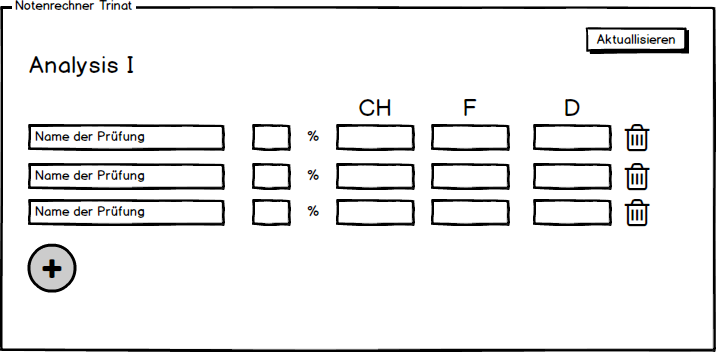
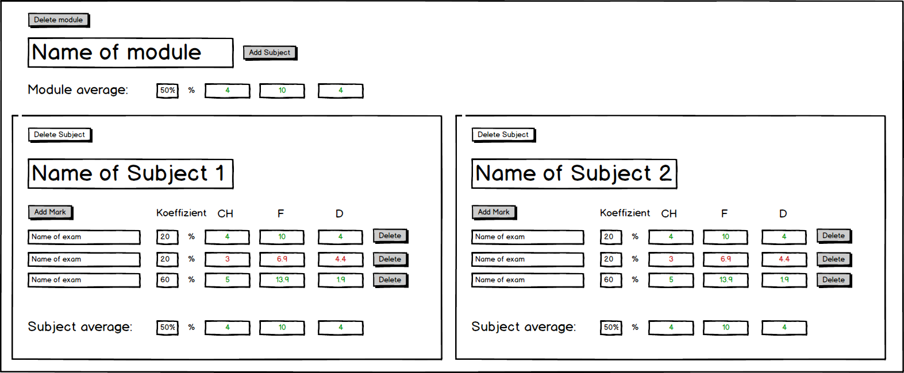

<h1>Trinat-Marks<h1>

 

# Table of contents
1) [Members](<https://github.com/savend/Trinat-Marks#members>)
2) [Introduction](https://github.com/savend/Trinat-Marks#introduction)
3) [Goals](https://github.com/savend/Trinat-Marks#goals)
4) [Boundary conditions](https://github.com/savend/Trinat-Marks#boudary-conditions)
5) [Build Instructions](https://github.com/savend/Trinat-Marks#build-instructions)
6) [Operation manual](https://github.com/savend/Trinat-Marks#operation-manual)
7) [User Stories](https://github.com/savend/Trinat-Marks#user-stories)
8) [Release plan](https://github.com/savend/Trinat-Marks#release-plan)
9) [Documentation Sprint 1](https://github.com/savend/Trinat-Marks#documentation-sprint-1)
10) [Documentation Sprint 2](https://github.com/savend/Trinat-Marks#documentation-sprint-2)
11) [Documentation Sprint 3](https://github.com/savend/Trinat-Marks#documentation-sprint-3)

# Members

Adrian Rosser, Audric Strümpler, David Buchleither, Remy Meyer, Thomas Penner 

# Introduction

The project **"Trinat Marks"** and the corresponding Git repository was developed as part of a project work in the course Software Engineering in the study course Mechatronics trinational. The implementation was realized with Java. 

# Goals

The aim is to translate the competences learned in the subjects Programing and Software Engineering into an independent student project. Our project is a grade calculator.

The goal is to give the student an overview of his academic achievements.

He has the possibility to create individual modules and to equip them with subordinated subjects. 

Furthermore, the grades obtained during the course can be used in the languages German, French and Swiss German, whereby the student receives his grades in all 3 country scales.

The passed modules are highlighted in green, the failed modules in red. 

In addition, it is possible to save the scores that have been inserted and completed.

# Boundary conditions

The application should be programmed in JAVA and the classes of the program should have the corresponding unit tests.

The project should be published on GitHub.

We want to divide the program into different classes and structure them with methods.

The condition is that this program can be used by MAC, Windows and LinuxComputers.

# Build Instruction

1) **Download the file from our repository in Github.**

2) **Extract the downloaded file into the desired folder.**

3) **Copy** *(Strg+c)* **the path of the desired version file (.jar) to the clipboard.**

4) **Open the console of your computer.**

5) **Enter java -jar followed by the copied path (.jar).**

6) **Confirm your entry with Enter.**

# Operation manual

**A short functional description of our calculator:**

1) Start application according to build instructions

2) A window will open where you have the possibility to add a module.

3) After the module has been added, you can add a subject.

4) You can now use a test with the associated coefficient in this compartment.

5) Afterwards you have the possibility to enter your mark in one of the 3 country scales.

6) The mark is then displayed in all scales.

7) If the mark Sufficient is not reached, the number is displayed in red, otherwise in green.

8) Furthermore there is the possibility to reset all marks.

 

// Bedienungsanleitung noch fertig schreiben (besser wenn das Programm fertig ist)

# User Stories

| **User Story 1** | **Prioritisation** |**Story Point** | **Acceptance criterium** |
|:-:|:-:|:-:|:-:|
|**As a user I want to have the bars turn red if my marks are not good so that I can see easely which Modul I have focus on**|High|2|hier kommt das akzeptanzkriterium ausführlich eingesetzt ein, dieser text ist ein lückenfüller|

 

| **User Story 2** | **Prioritisation** |**Story Point** | **Acceptance criterium** |
|:-:|:-:|:-:|:-:|
|**As a classleader I want to save a semester configuration to share it to all the class**|Realy low|13|hier kommt das akzeptanzkriterium ausführlich eingesetzt ein, dieser text ist ein lückenfüller|

 

| **User Story 3** | **Prioritisation** |**Story Point** | **Acceptance criterium** |
|:-:|:-:|:-:|:-:|
|**As a user I want to save my marks to not reenter all the time my results**|Low|13|hier kommt das akzeptanzkriterium ausführlich eingesetzt ein, dieser text ist ein lückenfüller|

 

| **User Story 4** | **Prioritisation** |**Story Point** | **Acceptance criterium** |
|:-:|:-:|:-:|:-:|
|**The Semester schould be configurable as I want for a sustainable programm**|High|5|hier kommt das akzeptanzkriterium ausführlich eingesetzt ein, dieser text ist ein lückenfüller|

 

| **User Story 5** | **Prioritisation** |**Story Point** | **Acceptance criterium** |
|:-:|:-:|:-:|:-:|
|**As a student, I want to delete marks, modules and semesters**|Low|8|hier kommt das akzeptanzkriterium ausführlich eingesetzt ein, dieser text ist ein lückenfüller|

 

| **User Story 6** | **Prioritisation** |**Story Point** | **Acceptance criterium** |
|:-:|:-:|:-:|:-:|
|**As a student, I want to add new marks**|High|2|hier kommt das akzeptanzkriterium ausführlich eingesetzt ein, dieser text ist ein lückenfüller|

 

| **User Story 7** | **Prioritisation** |**Story Point** | **Acceptance criterium** |
|-|-|-|-|
|**As a student I would like to have my grade average displayed to know if I have passed my modul**|High|3|hier kommt das akzeptanzkriterium ausführlich eingesetzt ein, dieser text ist ein lückenfüller|

 

| **User Story 8** | **Prioritisation** |**Story Point** | **Acceptance criterium** |
|:-:|:-:|:-:|:-:|
|**As a student I want to define a coefficent for each topic and mark**|High|2|hier kommt das akzeptanzkriterium ausführlich eingesetzt ein, dieser text ist ein lückenfüller|

 

| **User Story 9** | **Prioritisation** |**Story Point** | **Acceptance criterium** |
|:-:|:-:|:-:|:-:|
|**As a student, I want to get from 1 input mark the other two marks**|Realy high|8|hier kommt das akzeptanzkriterium ausführlich eingesetzt ein, dieser text ist ein lückenfüller|

 

| **User Story 10** | **Prioritisation** |**Story Point** | **Acceptance criterium** |
|:-:|:-:|:-:|:-:|
|**As a User I want to enter with a interface a mark in all nationalities to be flexible**|High|2|hier kommt das akzeptanzkriterium ausführlich eingesetzt ein, dieser text ist ein lückenfüller|

# Release plan

|**Userstory**|**Release 1**|**Release 2**|**Release 3**|
|:-:|:-:|:-:|:-:|
|**1**|||Expansion stage 2|
|**2**|||Expansion stage 2|
|**3**||Expansion stage 1||
|**4**|||Expansion stage 2|
|**5**||Expansion stage 1||
|**6**|Basic requirement|||
|**7**||Expansion stage 1||
|**8**|Basic requirement|||
|**9**|Basic requirement|||
|**10**|Basic requirement|||

**Info:** The time between each realese is 1 week.

# Documentation Sprint 1
|**User Story**|**Tasks**|**Time estimation in minutes**|
|:-:|:-:|:-:|
|**10**|Mark input in any language|40|
|**9**|Entering a mark, output to the other two|160|
|**8**|Create own coefficients|40|
|**6**|Adding new marks|40|

//Enrichment of user stories for implementation

# Documentation Sprint 2
|**User Story**|**Tasks**|**Time estimation in minutes**|
|:-:|:-:|:-:|
|**3**|Save notes|200|
|**5**|Delete marks, modules and semesters|160|
|**7**|Display grade average|60|

//Enrichment of user stories for implementation

# Documentation Sprint 3
|**User Story**|**Tasks**|**Time estimation in minutes**|
|:-:|:-:|:-:|
|**1**|Grade worse than (F10.0) D(4.0) CH(4.0) mark red|20|
|**2**|Save and share semester configuration|200|
|**4**|Sustainable programm|60|

//Enrichment of user stories for implementation
